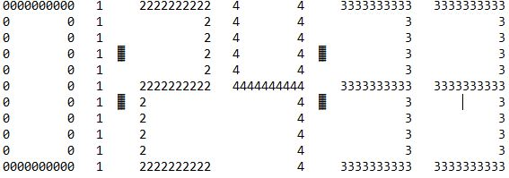
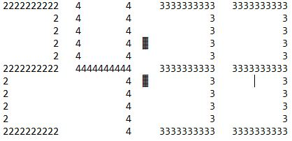
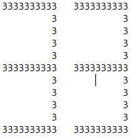

# UP_21-22_fn8MI0600036_KP09-prakt

**СУ „Св. Климент Охридски“, ФМИ**

Специалност „Софтуерно Инженерство“

**Увод в програмирането (практикум)**
2021-2022 г.

**Задание за курсов проект № 9 - ASCII timer**

Да се напише програма, която реализира четирицифрен таймер, размерът на цифрите на който е 11х10 символа (ASCII art[^1]).

При стартиране на програмата да се въвежда от потребителя число (брой секунди), след което таймерът започва да отброява оставащото време във формат <ЧАСОВЕ:МИНУТИ:СЕКУНДИ>.

**Звукови сигнали/команди:**

При нулиране на таймера да се възпроизвежда звуков сигнал.

**Визуализация:** 

- Таймерът да се визуализира центриран спрямо прозорец на конзолата с размери 80х25 символа.
- Всяка цифра да се изобразява с помощта на съответния ASCII символ (*виж примера*).
- Всяка цифра да се изобразява с различен цвят, който да се избира по случаен принцип.
- При оставащи по-малко от 15 минути да се оцветяват всички цифри в жълто.
- При оставащо време по-малко от 1 минути да се оцветяват всички цифри в червено.
- При оставащо време по-малко от 10 секунди, всички цифри да примигват.

**Пример:** 

Визуализацията на таймера може да изглежда така:

- **hh/mm/ss - hours : minutes : seconds**

- **mm/ss - minutes : seconds**

- **only seconds**

[^1]: Повече за т.нар. ASCII art, може да прочетете тук: <https://www.asciiart.eu/faq>
